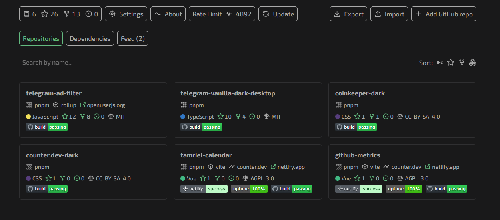

# Отслеживание метрик и зависимостей JS-проектов в GitHub

Если вы ведёте сразу несколько пет-проектов в GitHub, вам может быть сложно отслеживать все метрики.

[GitHub Metrics](https://github-metrics.netlify.app) собирает данные о репозиториях и показывает количество звёзд, форков, issues. Помимо этого, сервис парсит `package.json` и отображает используемый пакетный менеджер, бандлер, фреймворки для тестов и статус последнего CI-билда. Передав токены, дополнительно можно подключить бейджи **UptimeRobot** и **Netlify Deploy Status**.

Кроме того, генерируется таблица со списком всех зависимостей и их версий. Если вы стараетесь придерживаться единого стека, инструмент поможет быстро выявить устаревшие зависимости (например, старые major‑версии) или случаи, когда для одной задачи используются разные библиотеки.

**GitHub Metrics** — это не CI-утилита и не облачный билд-сервис, а простой и наглядный дашборд, который помогает навести порядок в зоопарке пет-проектов. Один раз настроив его, вы сможете быстро увидеть, где устарели пакеты, где забыли про лицензию или CI, а где появились новые звёзды.
