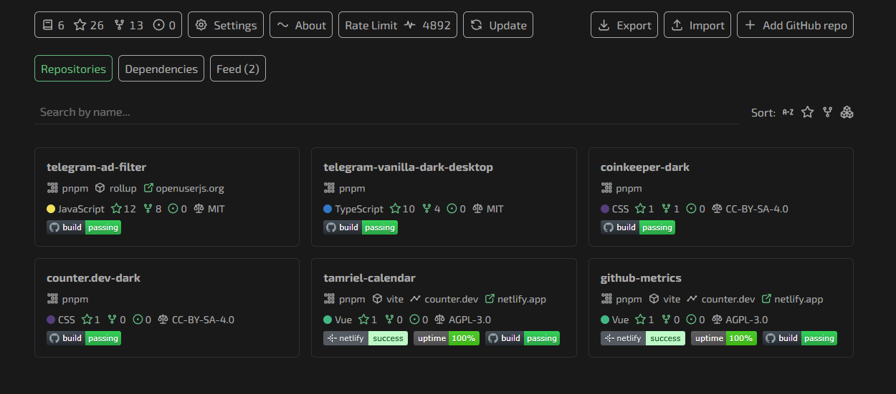
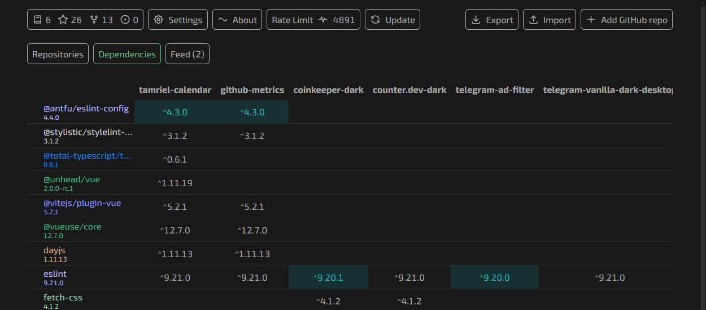

# Tracking metrics and dependencies of JS projects in GitHub

If you are managing multiple pet projects on GitHub, it can be difficult to keep track of all the metrics.

[GitHub Metrics](https://github-metrics.netlify.app) collects data about repositories and shows the number of stars, forks, and issues. In addition, the service parses `package.json` and displays the package manager, bundler, test frameworks, and the status of the latest CI build. By passing tokens, you can additionally connect **UptimeRobot** and **Netlify Deploy Status** badges.

In addition, a table is generated with a list of all dependencies and their versions. If you are trying to stick to a single stack, the service will help you quickly identify outdated dependencies (e.g., old major versions) or cases where different libraries are used for the same task.

**GitHub Metrics** is not a CI utility or a cloud build service, but a simple and intuitive dashboard that helps you organize your projects. Once you set it up, you can quickly see where packages are outdated, where licenses or CI have been forgotten, and where new stars have appeared.
